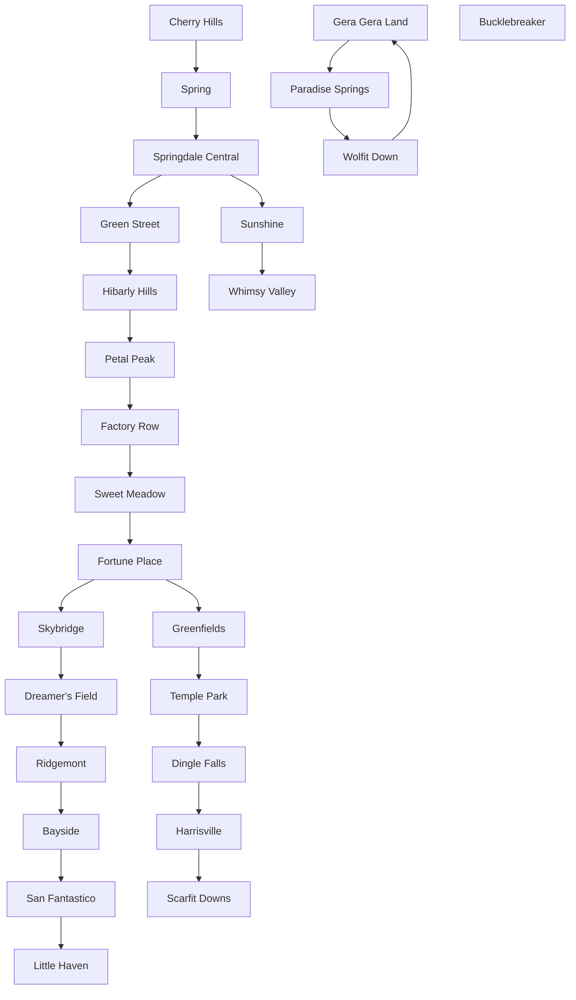

# Trains

## CfgBin-Tags

```
TRAIN_DATA (
	TrainID|True
	Direction(0=Left,1=Right)|False
	Line|False
	TrainType|False
	DestinationStationName|True
	Cond|False
	DisplayedDestination|False
	OpposingTermStation|True
	Unk8|False
	TrainRank|False
	TrainTribe|False
)
```
### Explanation
* `Line`
  * 0: Central Line
  * 1: Central Express Line
  * 2: Echo Line
  * 3: Fox Line
  * 4: Hexpress/Happy-Go-Lucky
* `TrainType`
  * 0: Normal
  * 1: Nonstop
  * 2: Hexpress
  * 3: Happy-Go-Lucky Express
* `DestStationName`: The terminating station
* `DisplayedDestination`: The displayed train's destination (if empty `DestStationName` is used)
* `TrainRank` (Hexpress): Rank of the train (0 = E, 1 = D, ...)
* `TrainTribe` (Hexpress): Tribe of the train (1 = Charming, ...)

---

```
TRAIN_STATION (
    StationName|True
    ParentStation|True
    StationType|False
    TrainOutisde|False
    Unk4|False
    Unk5|False
    Unk6|False
    Unk7|True
    AssociatedMap|True
    Unk9|False
    Unk10|False
    Unk11|False
    Unk12|False
    Unk13|False
    TerminationStation|False
    TerminationCond|False
    Unk16|False
    Unk17|False
    Unk18|False
)
```
### Explanation
* `StationType`: 
  * 0-2: Normal Station
  * 3: Hexpress Station
* `TrainOutside`: `MapID` of map outside the window
* `TerminationStation`: Is the station the last station
* `TerminationCond`: If condition is false `TerminationStation` gets overwritten to 0.

## The Train Network
The train network is modeled as a graph, where each station has at most one parent station.
### "Human" Trains
Depending on the current station, the destination station of the train and the direction of the train, the game determines the next station as follows:  
If the train moves to the right: It tries to find a way through the network, by always going from child to parent.  
If the train moves to the left: It tries to find a way through the network, by always going from parent to child.  
The central express line is an exception.

The player is forced to leave the train if the train's `DestinationStation` matches the next station or the next station has `TerminationStation` set to 1 and `TerminationCond` evaluated to true.

### Hexpress Trains
As the player can walk in Hexpress trains, these trains teleport to the destination station, once the player interacts with the Strangineer.

### The Train Network of Yo-kai Watch 2
The arrow points from parent to child.



### Arriving Trains
The next train is always a random train from all possible trains (except the Happy-Go-Lucky Express).  
If the `StationType` is 3, the arriving trains are saved and no train can arrive twice, before every train arrived once (again, the Happy-Go-Lucky Express is an exception).  

Hexpress Trains (`Line`=4, `TrainType`=2) can only arrive at stations with `StationType`=3 and Whimsy Valley.

### Happy-Go-Lucky Express
Each time the player enters a station there is a 10% chance that a bit flag (`0x33CEE5A0`) is set to 1 (otherwise it's set to 0). If this flag is set to 1, every arriving train has a 10% chance to be
the Happy-Go-Lucky Express.

